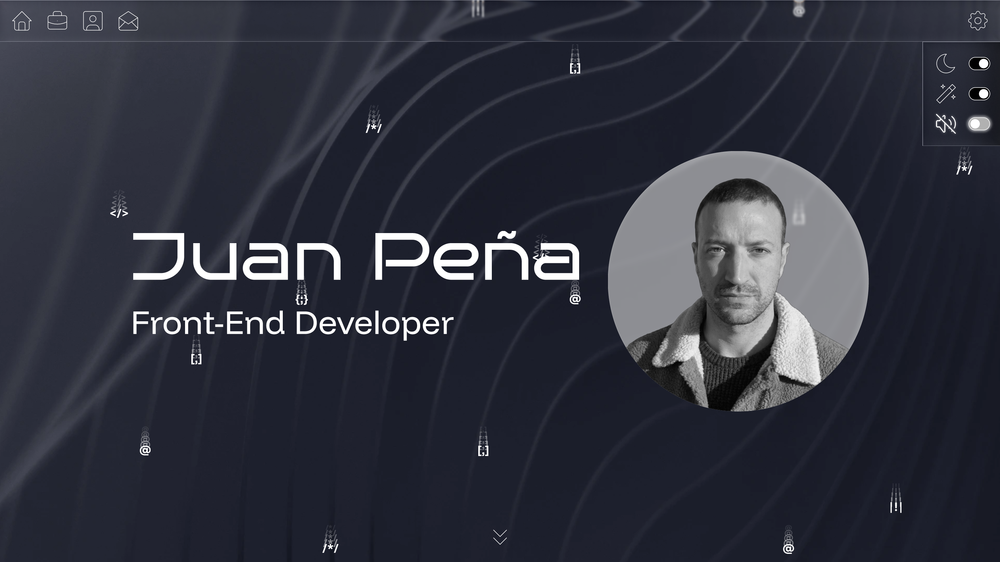

  

  <h1 align="center">Portfolio Profesional juanpdev.com</h1>
  
<b>Desarrollo web artesanal y diseño estructural de alto rendimiento</b>

<h2 align="center">🎯 Propósito del Repositorio 🎯</h2>

Este repositorio contiene el código fuente íntegro de mi portfolio personal. El proyecto ha sido concebido como un espacio centralizado para exponer mis desarrollos de software, encapsular mi trayectoria técnica como ingeniero de edificación reconvertido al desarrollo frontend, y facilitar canales directos de contacto para procesos de reclutamiento y colaboración profesional.

La meta principal es ofrecer una carta de presentación interactiva que sirva como auditoría en vivo de mis capacidades metodológicas, la limpieza de mi código, y mi criterio técnico.

<h2 align="center">⚡ Funcionalidades Destacadas ⚡</h2>

El proyecto está diseñado bajo una arquitectura modular y fluida, priorizando la interactividad del usuario y el control absoluto de la experiencia en el navegador a través de las siguientes características:

<ul>
  <li><b>Arquitectura Seccionada:</b> Navegación optimizada a través de apartados independientes y limpios, diseñados para segmentar la información técnica de manera estratégica.</li>
  <li><b>Inmersión Acústica:</b> Integración de efectos de sonido interactivos que enriquecen el flujo de navegación, aportando una capa multimedia diferenciadora. El sistema incluye un control dedicado para activar o silenciar el audio, garantizando el confort del usuario.</li>
  <li><b>Animaciones:</b> Implementación de animaciones fluidas e interactivas que aportan dinamismo a la interfaz. El sistema incluye un mecanismo global para activar o desactivar las animaciones, garantizando la accesibilidad y adaptándose a las preferencias de rendimiento del usuario.</li>
  <li><b>Gestión de Modos:</b> Soporte integrado para la personalización del entorno visual, optimizando el contraste según las necesidades del contexto de lectura.</li>
</ul>

<h2 align="center">🛡️ Principios de Ingeniería y Fundamentación Técnica 🛡️</h2>

La construcción de este portfolio esquiva deliberadamente las corrientes de automatización masiva para centrarse en los pilares fundamentales de la ingeniería de software web:

<h3>1. Desarrollo 'Vanilla' y Control del Entorno</h3>

Se ha prescindido por completo de <i>frameworks</i> pesados o librerías de terceros que añadan dependencias opacas. Todo el comportamiento interactivo, el enrutamiento y la manipulación del árbol de nodos se ejecutan mediante código nativo. Esto demuestra un conocimiento profundo de los fundamentos de la plataforma web, y garantiza que no existan capas de abstracción innecesarias que distorsionen y dificulten el control directo sobre el ciclo de vida de la aplicación.

<h3>2. Rendimiento Bruto y Optimización Estricta</h3>

Al no cargar código sobrante ni dependencias heredadas, el peso de la aplicación se reduce al mínimo teórico. Esto se traduce en una velocidad de carga instantánea, una economía de procesamiento máxima en el cliente y una eficiencia sin concesiones en el consumo de memoria del navegador.

<h3>3. Código Limpio, Elegante y Sostenible</h3>

El desarrollo se estructura bajo una lógica matemática y predecible, utilizando funciones tradicionales para asegurar una legibilidad inmediata. El resultado es un código limpio, transparente para el contexto y altamente mantenible, donde cada hito se gestiona de forma atómica.
